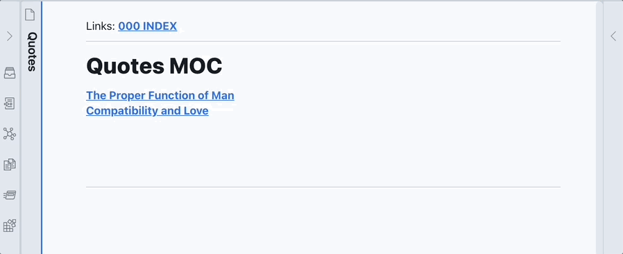
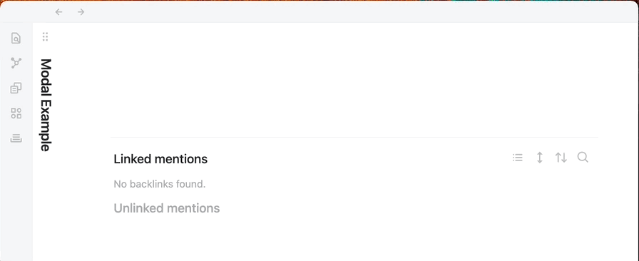

# AutoMOC for Obsidian

This plugin is designed to make the maintenance of MOCs a simpler process. <br>

When taking notes, one may forget to provide the backlink to the MOC for which a new note was linked. Over time this leads to many purely directional links. MOCs may miss many notes they are linked to simply by the user forgetting. A similar problem is found for those users who use tags to group notes and want to maintain a running list of those notes.<br>

This plugin imports missing linked mentions or tagged mentions into the current note at the current cursor location. <br><br>

TL;DR the plugin provides a quick way to link back to all linked mentions or tagged mentions for a given note.
<br>

## Usage

There are two commands that are currently supported: <br>

1. Import notes based on linked mentions

-   The plugin checks for linked mentions matching the current file's name

2. Import notes based on tagged mentions

-   The plugin checks for tags matching the tag selected from a modal popup

*   **NEW**: Support for frontmatter tags has been added

After enabling this plugin, place your cursor in an editable markdown note where you want the links to be added.

<br>
Command 1 can be run through the command pallette, a keyboard shortcut (must be mapped), or the ribbon button. Missing linked mentions will be added into the current note at the current cursor position.



**Note:** There is an option to disable the ribbon button in the plugin settings. The plugin can still be activated by using the command pallete or by using a mapped hotkey.

<br>
Command 2 can be through the command pallette, or a keyboard shortcut (must be mapped), but not through the ribbon button. It will open a modal which will prompt for a tag. Once you select the tag you want, all notes that have the tag will be imported into the current note at the current cursor position.



### Frontmatter Support

The plugin will check to see if a note has aliases in its frontmatter. If it finds one, it will import the note with the alias so that the link will be

```
[[NOTE|ALIAS]]

and will show up as

ALIAS

in Preview Mode
```

**NOTE:** you must use the proper YAML frontmatter structure shown below. Otherwise, the alias/tag will not be recognized

```
aliases: [alias1, alias2]
tags: tag1, tag2
```

or

```
aliases:
- alias1
- alias2
tags:
- tag1
- tag2
```

Frontmatter tags do not have a "#" prepended to them. Putting a "#" before a frontmatter tag is invalid YAML and will cause the tag not to be recognized.

**NOTE:** Frontmatter tags cannot be linked to the nearest heading

<br>

**NEW**: The plugin now has support for anchor links (linking to headings). This option is available in the plugin settings. When on, the plugin will search for the heading closest to the link or tag specified. This is done a greedy manner

## Known issues

When creating a new link or tag, it may take a while for Obsidian to resolve the link/tag. In this time, the new link/tag may not be visible to the plugin and it will report "No new links found". To avoid this wait a couple of seconds between creating a new link/tag and running the AutoMOC plugin.

It is possible there are other bugs. If you come across one, please do report it under the issues tab in GitHub.

## Pricing

This plugin is provided to everyone for free, however if you would like to say thanks or help support continued development, consider getting me a coffee. It keeps my work going.

<a href="https://www.buymeacoffee.com/dalca7" target="_blank"></a>
